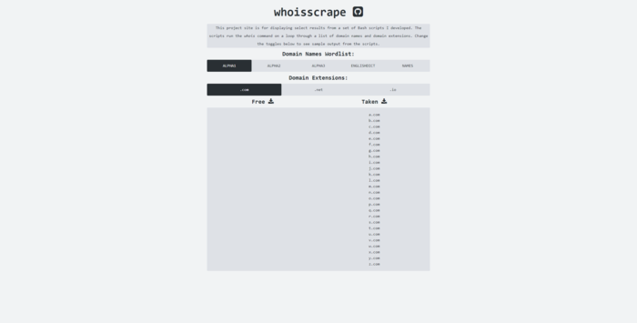

Bash scripts to run the whois command on a loop through a list of domain names and domain extensions.

Built using Bash scripts. A Python script for formatting data into JSON format. Project site is developed using vanilla JavaScript.
