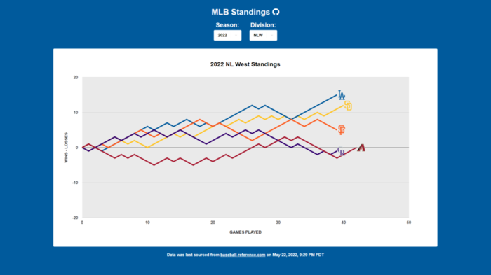

Website to graph the changes in MLB division standings throughout a season.

Built using React, Google Charts, and Google Firestore. A Python script running in Google Cloud Functions is used to gather the current MLB standings data.
